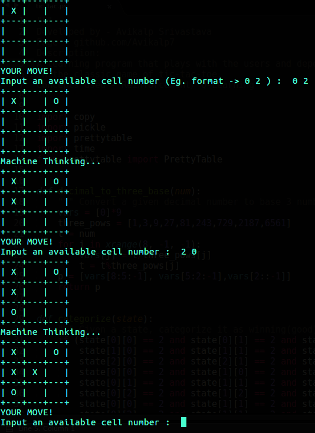
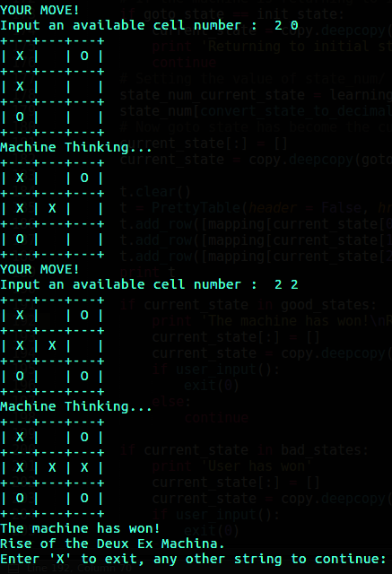

# TicTacToe Reinforcement Learning
A learning program that plays with the users and depends on their inputs to learn optimal strategy
in the classic game of tic-tac-toe.

### Running the Script
- Ensure you have python(>2) on your system
- Use the following commands for dependencies:
  - pip install prettytable
  - pip install pickle
- Clone this repository
- Run 'python tic_tac.py' in the src directory

### Few Pointers on Playing Strategy:
- How fast the machine learns depends on your inputs, as well as their sequence. If you are familiar with Q-Learning, you can most probably realise the ideal sequence, but its more fun seeing the machine learn in a 'random way'.
- The learning process for the program can be quite slow for some states of the game, and you might question if its learning at all. In this circumstance, you have to know that Q-Learning needs those large iterations for its running and will eventually learn.
- It is tricky to train your machine such that it becomes impossible to beat as it requires covering all test cases. Challenge your friends against your trained machine to see its prowess.

### Few Pointers on Working of the Program:
- At any time you exit, your progress is saved in a .p file
- Next time you run the program, you can load your progress from the .p file when the program prompts you.
- If you choose not to load your progress however, your previous progress will be lost and current one will be saved. Progress versions are not yet supported

### Sneak-Peaks from the Gameplay

